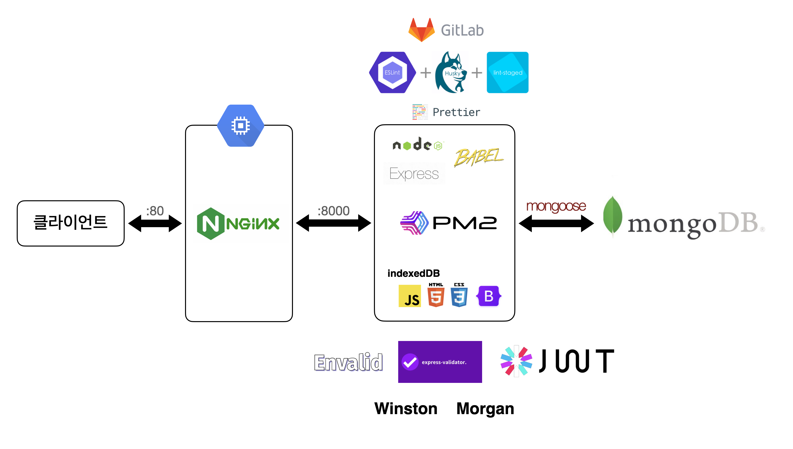

# 위판가 직거래 플랫폼 "오늘바다"

  

## **0. 팀 소개**

---

팀명: 해3물 (3팀)

팀 구성

- FE: 박우찬(팀장), 설지윤, 이예나
- BE: 김영범, 김익수

노션 페이지: https://www.notion.so/cbebef6f6b6e402ab27b7ee0bbc393a5

 

---

## **1. 서비스 소개**
신선한 수산물과 합리적인 가격을 찾는것은 어렵습니다. “단순하게 접근해볼까?” 라는 질문에서 시작되어 투명하게 유통과정을 공개하고 산지직송 서비스를 제공하면 어려움을 해소 할 수 있다고 생각했습니다. 오늘바다 서비스는 수산물의 유통과정을 투명하게 확인하고 믿고 구매할 수 있는 해산물 전문 쇼핑몰입니다.
 

### **1-1. 서비스 기획**

---

#### **서비스 Version 1.0 Grand OPEN**

1. 사용자 관련 기능 구현
   > - 회원가입, 로그인, 로그아웃
   > - 마이페이지 (사용자 정보, 주문 정보, 회원 탈퇴)
2. 카테고리 및 상품 관련 기능 구현
   > - 카테고리 별 상품 리스트 조회
   > - 상품 세부 페이지
3. 장바구니, 주문 기능 구현
   > - 장바구니 추가, 수정, 삭제, 조회 등 기능 구현
   > - 장바구니 상품 주문 기능 구현
   > - 주문 후 배송 정보 수정 기능 구현
4. 관리자 페이지 기능 구현
   > - 카테고리 관리 기능
   > - 상품 관리 기능
   > - 주문 관리 기능

---

 

#### **기획안 링크**

### https://www.notion.so/3821f5c24f63448e8d0c5087b6b40d0f#a87b9ff1cca54c28a88cee1c3d82ead9

 

---

### 1-2. **와이어프레임**

### https://www.figma.com/file/BR3WBFKniUGtdlR3aqyna4/OneulBada?node-id=0%3A1&t=VOLLpA4pIqA3nYSL-0

 

---

 

### 1-3. **자료 구조 설계, DB Schema**

### https://www.erdcloud.com/d/gkDc5r2oqNCWCYhLe

 

---

 

### 1-4. **API 문서**

### https://www.notion.so/a259c06258e04e859a97327466715e1a?v=d41a4abdc4554bc38816f32f3f09da57

 

---

 

## 2. 기술 스택 및 인프라 구조

  

 

- **(BE) nodeJS, express, BABEL, mongoose**

> - (validation) envalid, express-validator
> - (logger) morgan, winston
> - (authentication) JWT

- **(FE) JS, HTML, CSS, bootstrap, indexed-db**

> - daum 도로명 주소 api

- **(DB) mongoDB Atlas**

- **(DEPLOY) NginX, PM2, Google Compute Engine**

 

---

본 프로젝트에서 제공하는 모든 코드 등의는 저작권법에 의해 보호받는 ㈜오늘바다의 자산이며, 무단 사용 및 도용, 복제 및 배포를 금합니다.
Copyright (주)엘리스 SW 트랙 해3물 3팀 Inc. All rights reserved.
